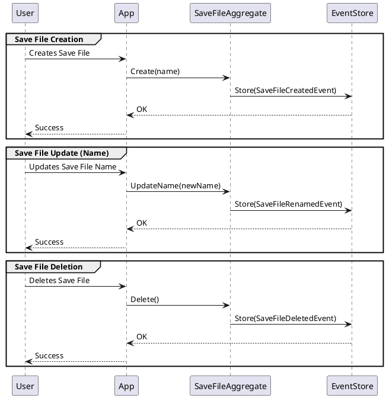
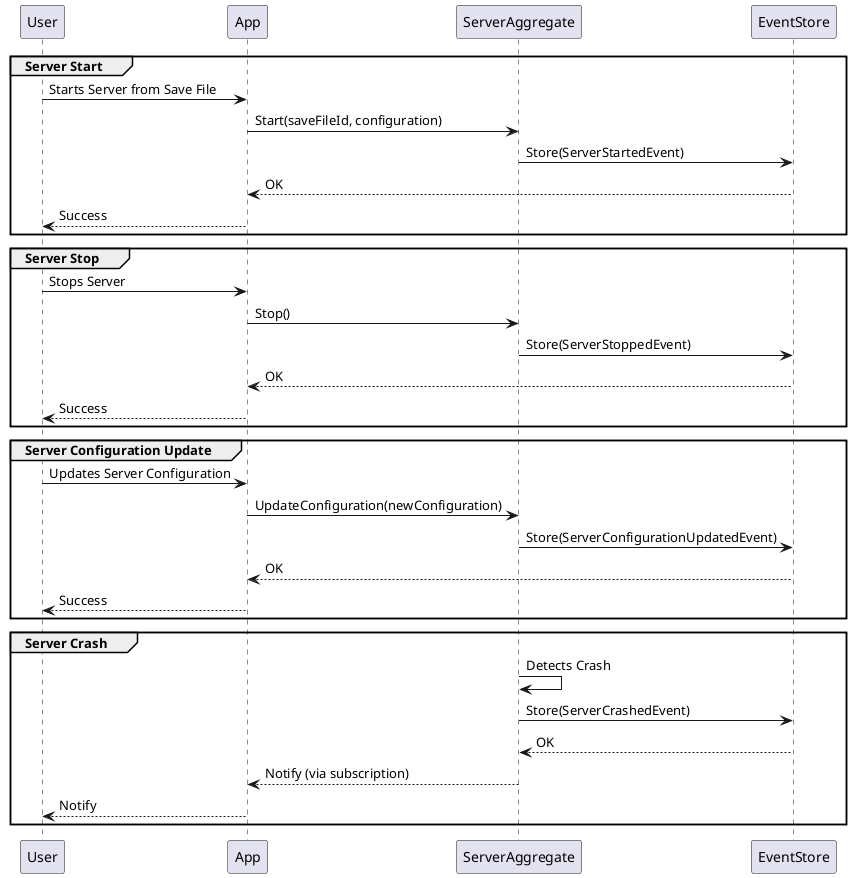

## **Event-Sourced Design for Minecraft Server Management**

This document outlines the design of an event-sourced system for managing Minecraft servers, allowing users to create
and manage save files and spin up/down servers on demand.

### **Core Concepts**

- **Save File:** The core aggregate in this domain. A save file represents a Minecraft world and associated data. Users
  can create multiple save files.
- **Server:** A Minecraft server instance. A server is associated with a save file. Users can start and stop servers for
  a given save file. Multiple servers should not be running for the same save file at the same time.
- **Event Sourcing:** The system's state is persisted as a sequence of events. The current state is derived by replaying
  these events.
- **Domain-Driven Design (DDD):** The design is driven by the domain, with a focus on aggregates, entities, and value
  objects.
- **Eventual Consistency:** Changes to the system's state are eventually reflected in the read side.

### **System Architecture**

The system will be designed with the following components:

- **User Interface (UI):** Allows users to interact with the system (create save files, start/stop servers, etc.).
- **Application Layer:** Handles user requests (commands), interacts with the domain layer, and orchestrates the flow of
  events.
- **Domain Layer:** Contains the core business logic, including aggregates (SaveFile, Server), entities, and value
  objects.
- **Event Store:** A database for storing the sequence of events.
- **External Server Service:** An external service (API) responsible for starting and stopping Minecraft server
  instances.

### **Event Definitions**

The following events are used to capture state changes in the system:

#### **Save File Events**



- `SaveFileCreatedEvent`: Recorded when a new save file is created. Contains the save file's ID and name.

```java

@Value
class SaveFileCreatedEvent implements SaveFileEvent {

  String saveFileId;
  String name;
}
```

- `SaveFileRenamedEvent`: Recorded when a save file's name is changed. Contains the save file's ID and the new name.

```java

@Value
class SaveFileRenamedEvent implements SaveFileEvent {

  String saveFileId;
  String newName;
}
```

- `SaveFileDeletedEvent`: Recorded when a save file is deleted. Contains the save file's ID.

```java

@Value
class SaveFileDeletedEvent implements SaveFileEvent {

  String saveFileId;
}
```

#### **Server Events**



- `ServerStartedEvent`: Recorded when a server is successfully started from a save file. Contains the server's ID and
  the associated save file's ID.

```java

@Value
class ServerStartedEvent implements ServerEvent {

  String serverId;
  String saveFileId;
}
```

- `ServerStoppedEvent`: Recorded when a server is stopped. Contains the server's ID.

```java

@Value
class ServerStoppedEvent implements ServerEvent {

  String serverId;
}
```

- `ServerConfigurationUpdatedEvent`: Recorded when a server's configuration is changed. Contains the server's ID and the
  new configuration.

```java

@Value
class ServerConfigurationUpdatedEvent implements ServerEvent {

  String serverId;
  ServerConfiguration newConfiguration;
}
```

- `ServerCrashedEvent`: Recorded when a server crashes.

```java

@Value
class ServerCrashedEvent implements ServerEvent {

  String serverId;
  String reason;
  LocalDateTime timestamp;
}
```

- `ServerStartFailedEvent`: Recorded when a server fails to start.

```java 

@Value
class ServerStartFailedEvent implements ServerEvent {

  String serverId;
  String saveFileId;
  String reason;
}
```

### **Aggregate Behavior**

Aggregates are responsible for maintaining the consistency of their state and enforcing business rules.

#### **SaveFile Aggregate**

```java
// Server Status Enum
enum ServerStatus {
  NOT_RUNNING,
  RUNNING,
  STARTING,
  STOPPING
}

// Save File Aggregate
class SaveFile {

  private String id;
  private String name;
  private String serverId;
  private ServerStatus serverStatus;

  // Constructor (for creating new SaveFile)
  private SaveFile(String id, String name) {
    this.id = id;
    this.name = name;
    this.serverStatus = ServerStatus.NOT_RUNNING; // Initial status
  }

  // Apply Event (used when replaying history)
  private SaveFile(List<SaveFileEvent> events) {
    this.serverStatus = ServerStatus.NOT_RUNNING; // Default
    for (SaveFileEvent event : events) {
      apply(event);
    }
  }

  // Static factory method to reconstruct aggregate from events
  public static SaveFile fromEvents(List<SaveFileEvent> events) {
    return new SaveFile(events);
  }

  private void apply(SaveFileEvent event) {
    if (event instanceof SaveFileCreatedEvent e) {
      this.id = e.getSaveFileId();
      this.name = e.getName();
    } else if (event instanceof SaveFileRenamedEvent e) {
      this.name = e.getNewName();
    } else if (event instanceof SaveFileDeletedEvent e) {
    } else if (event instanceof ServerStartedEvent e) {
      this.serverId = e.getServerId();
      this.serverStatus = ServerStatus.RUNNING;
    } else if (event instanceof ServerStoppedEvent e) {
      this.serverStatus = ServerStatus.NOT_RUNNING;
      this.serverId = null; // Clear the server ID
    } else if (event instanceof ServerStartFailedEvent e) {
      this.serverStatus = ServerStatus.NOT_RUNNING;
      this.serverId = null;
    }
    // else if ... handle other events
  }

  // Factory method to handle creation.
  public static SaveFile create(String id, String name) {
    // Business logic/invariants
    if (name == null || name.trim().isEmpty()) {
      throw new IllegalArgumentException("Save file name cannot be empty.");
    }
    return new SaveFile(id, name);
  }

  public void updateName(String newName) {
    // Business logic/invariants
    if (newName == null || newName.trim().isEmpty()) {
      throw new IllegalArgumentException("Save file name cannot be empty.");
    }
    if (this.name.equals(newName)) {
      return; // No change
    }
    // Raise event
    DomainEvents.raise(new SaveFileRenamedEvent(this.id, newName));
    apply(
        new SaveFileRenamedEvent(
            this.id, newName)); // Apply the event to the aggregate's state *immediately*
  }

  public void delete() {
    if (isDeleted()) {
      throw new IllegalStateException("Save file is already deleted.");
    }
    DomainEvents.raise(new SaveFileDeletedEvent(this.id));
    apply(new SaveFileDeletedEvent(this.id));
  }

  public void startServer(String serverId) {
    if (this.serverStatus == ServerStatus.RUNNING || this.serverStatus == ServerStatus.STARTING) {
      throw new ServerAlreadyRunningException(
          "A server is already running or starting for this save file.");
    }
    this.serverId = serverId;
    this.serverStatus = ServerStatus.STARTING;
    DomainEvents.raise(new ServerStartedEvent(serverId, this.id));
    apply(new ServerStartedEvent(serverId, this.id));
  }

  public void markServerRunning() {
    this.serverStatus = ServerStatus.RUNNING;
  }

  public void markServerStartFailed() {
    this.serverStatus = ServerStatus.NOT_RUNNING;
    this.serverId = null;
  }

  private boolean isDeleted() {
    // Logic to determine if the save file is deleted, based on events
    return false; // Placeholder
  }
  // other methods...
}

```

The SaveFile aggregate:

- Maintains its state (id, name, serverId, serverStatus).
- Enforces business rules, such as preventing starting a server if one is already running.
- Raises domain events to record state changes.
- fromEvents factory method to reconstruct the aggregate from a list of events.
- create factory method to create a new SaveFile.

#### **Server Aggregate**

The Server aggregate is responsible for managing the state of a Minecraft server instance. Its behavior is relatively
simple:

```java
class Server {

  private String id;
  private ServerStatus status;
  private ServerConfiguration configuration;

  private Server(String id, ServerConfiguration configuration) {
    this.id = id;
    this.configuration = configuration;
    this.status = ServerStatus.NOT_RUNNING;
  }

  private Server(List<ServerEvent> events) {
    for (ServerEvent event : events) {
      apply(event);
    }
  }

  public static Server fromEvents(List<ServerEvent> events) {
    return new Server(events);
  }

  public static Server create(String id, ServerConfiguration configuration) {
    return new Server(id, configuration);
  }

  private void apply(ServerEvent event) {
    if (event instanceof ServerStartedEvent e) {
      this.status = ServerStatus.RUNNING;
    } else if (event instanceof ServerStoppedEvent e) {
      this.status = ServerStatus.NOT_RUNNING;
    } else if (event instanceof ServerConfigurationUpdatedEvent e) {
      this.configuration = e.getNewConfiguration();
    } else if (event instanceof ServerCrashedEvent e) {
      this.status = ServerStatus.NOT_RUNNING;
    }
  }

  public void start() {
    if (this.status == ServerStatus.RUNNING || this.status == ServerStatus.STARTING) {
      throw new IllegalStateException("Server is already running or starting.");
    }
    this.status = ServerStatus.STARTING;
    DomainEvents.raise(new ServerStartedEvent(this.id));
    apply(new ServerStartedEvent(this.id));
  }

  public void stop() {
    if (this.status == ServerStatus.NOT_RUNNING) {
      throw new IllegalStateException("Server is not running.");
    }
    this.status = ServerStatus.STOPPING;
    DomainEvents.raise(new ServerStoppedEvent(this.id));
    apply(new ServerStoppedEvent(this.id));
  }

  public void updateConfiguration(ServerConfiguration newConfiguration) {
    this.configuration = newConfiguration;
    DomainEvents.raise(new ServerConfigurationUpdatedEvent(this.id, newConfiguration));
    apply(new ServerConfigurationUpdatedEvent(this.id, newConfiguration));
  }

  public void markCrashed() {
    this.status = ServerStatus.NOT_RUNNING;
    DomainEvents.raise(new ServerCrashedEvent(this.id));
    apply(new ServerCrashedEvent(this.id));
  }

  // other methods...
}
```

### **Application Layer**

The application layer orchestrates the interaction between the user, the domain layer, and external services.

```java

@Service
class SaveFileService {

  private final EventStore eventStore;
  private final ServerService serverService;

  public SaveFileService(EventStore eventStore, ServerService serverService) {
    this.eventStore = eventStore;
    this.serverService = serverService;
  }

  public String createSaveFile(String name) {
    String saveFileId = UUID.randomUUID().toString();
    SaveFile saveFile = SaveFile.create(saveFileId, name); // Use the factory
    eventStore.append(saveFileId, List.of(new SaveFileCreatedEvent(saveFileId, name)));
    return saveFileId;
  }

  public void updateSaveFileName(String saveFileId, String newName) {
    List<SaveFileEvent> events = eventStore.getEvents(saveFileId);
    SaveFile saveFile = SaveFile.fromEvents(events); // Rehydrate
    saveFile.updateName(newName); // Call aggregate method
    eventStore.append(saveFileId, DomainEvents.getRaisedEvents()); // Persist
    DomainEvents.clear();
  }

  public void deleteSaveFile(String saveFileId) {
    List<SaveFileEvent> events = eventStore.getEvents(saveFileId);
    SaveFile saveFile = SaveFile.fromEvents(events);
    saveFile.delete();
    eventStore.append(saveFileId, DomainEvents.getRaisedEvents());
    DomainEvents.clear();
  }

  public void startServer(String saveFileId, ServerConfiguration configuration) {
    List<SaveFileEvent> events = eventStore.getEvents(saveFileId);
    SaveFile saveFile = SaveFile.fromEvents(events);

    if (saveFile.getServerStatus() == ServerStatus.RUNNING || saveFile.getServerStatus() == ServerStatus.STARTING)
      throw new ServerAlreadyRunningException("A server is already running or starting for this save file.");

    String serverId;
    try {
      saveFile.startServer(serverId);  // Tell aggregate to start
      eventStore.append(saveFileId, DomainEvents.getRaisedEvents()); //persist
      DomainEvents.clear();
      serverId = serverService.startServer(configuration); // *Now* start the server
    } catch (ServerAlreadyRunningException ex) {
      throw ex; // Propagate original exception
    } catch (Exception ex) { // Catch other exceptions during server start
      // Handle the error (e.g., log, notify user)
      saveFile.markServerStartFailed(); //update aggregate
      eventStore.append(saveFileId, DomainEvents.getRaisedEvents());
      DomainEvents.clear();
      throw new ServerStartFailedException("Failed to start server: " + ex.getMessage(), ex);
    }

    saveFile.markServerRunning();  // Update status after successful start
    eventStore.append(saveFileId, DomainEvents.getRaisedEvents()); //persist
    DomainEvents.clear();

  }

  public void stopServer(String saveFileId) {
    List<SaveFileEvent> events = eventStore.getEvents(saveFileId);
    SaveFile saveFile = SaveFile.fromEvents(events);
    saveFile.stopServer();
    eventStore.append(saveFileId, DomainEvents.getRaisedEvents());
    DomainEvents.clear();
  }
  // other methods
}

@Service
class ServerService {

  //  method to start a server using an external API
  public String startServer(ServerConfiguration configuration) {
    //  Call external API
    //  Handle potential errors (e.g., API down, invalid configuration)
    if (/* API call fails */) {
      throw new ServerStartException("Failed to start server via external API.");
    }
    return "server-id-from-api"; //  Return the server ID from the API
  }

  public void stopServer(String serverId) {
    // call external API
  }
}

class ServerStartFailedException extends RuntimeException {

  public ServerStartFailedException(String message, Throwable cause) {
    super(message, cause);
  }
}
```

Key responsibilities of the application layer:

- Receives commands from the UI (e.g., CreateSaveFileCommand, StartServerCommand).
- Loads aggregates from the event store.
- Orchestrates domain logic by calling methods on aggregates.
- Interacts with external services (e.g., ServerService).
- Persists events to the event store.
- Handles errors and exceptions.

### **Event Store**

The Event Store is responsible for persisting events. It should have the following capabilities:

- Append events to a stream (e.g., by aggregate ID).
- Retrieve events for a stream (e.g., to reconstruct aggregate state).

### **Server Service**

The ServerService is an external service that interacts with the infrastructure to start and stop Minecraft server
instances. It is called by the SaveFileService in the application layer.